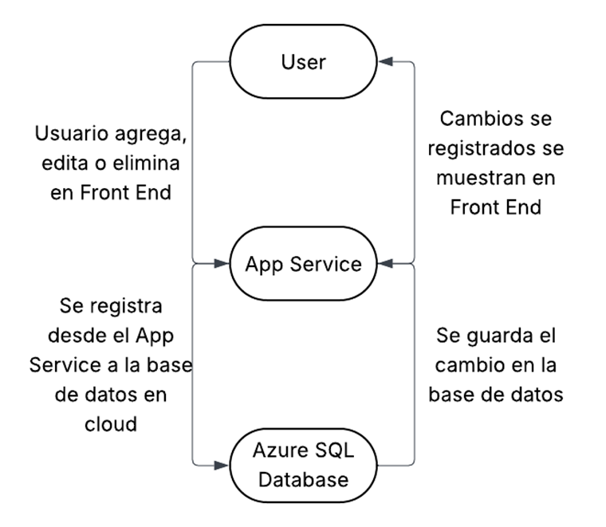
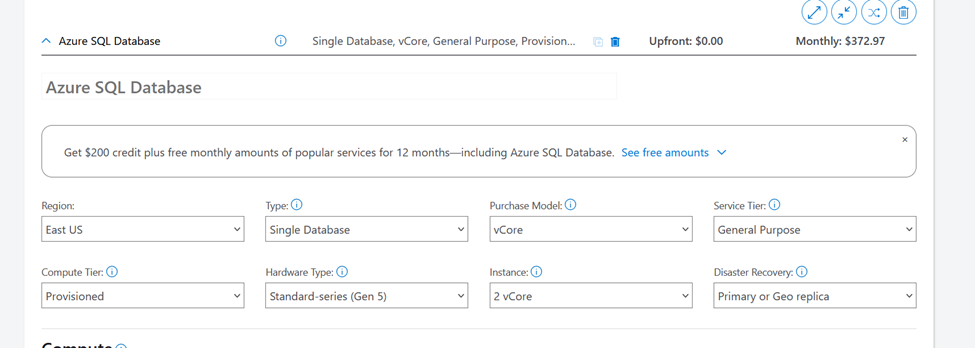
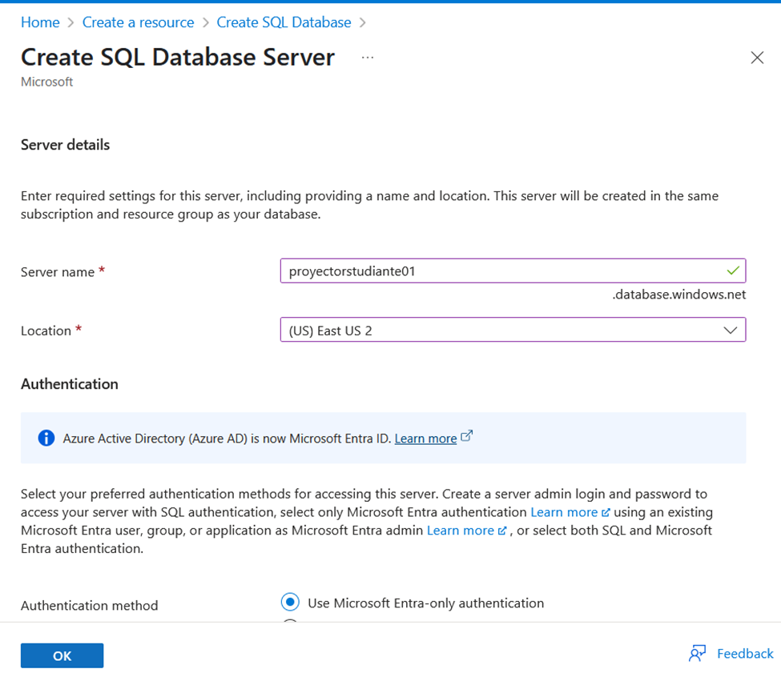
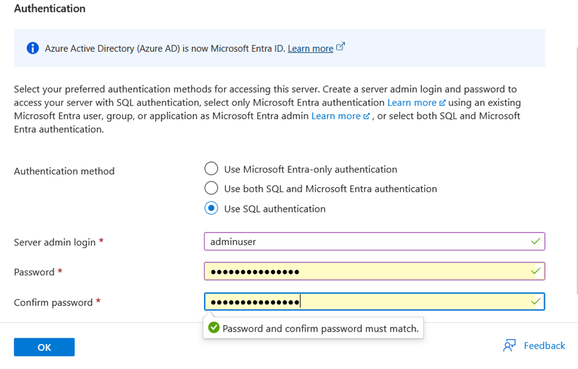
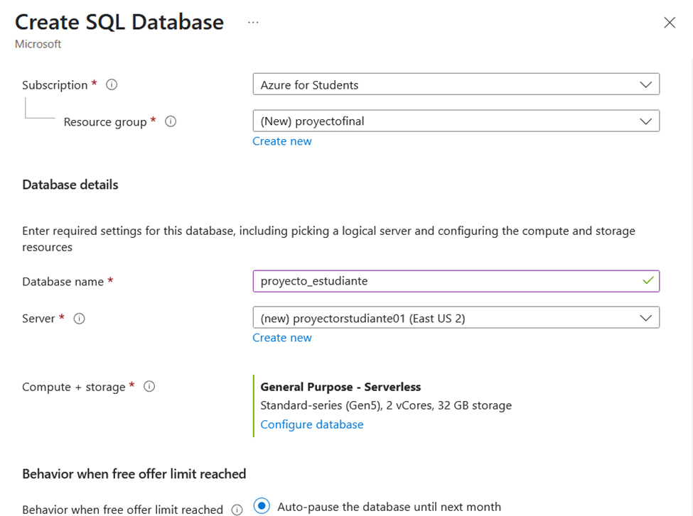
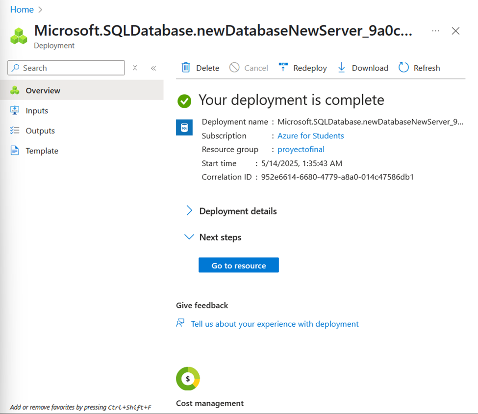
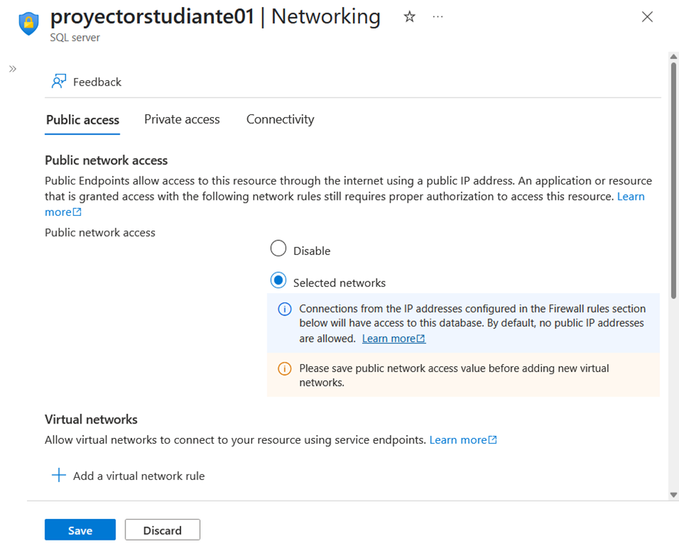
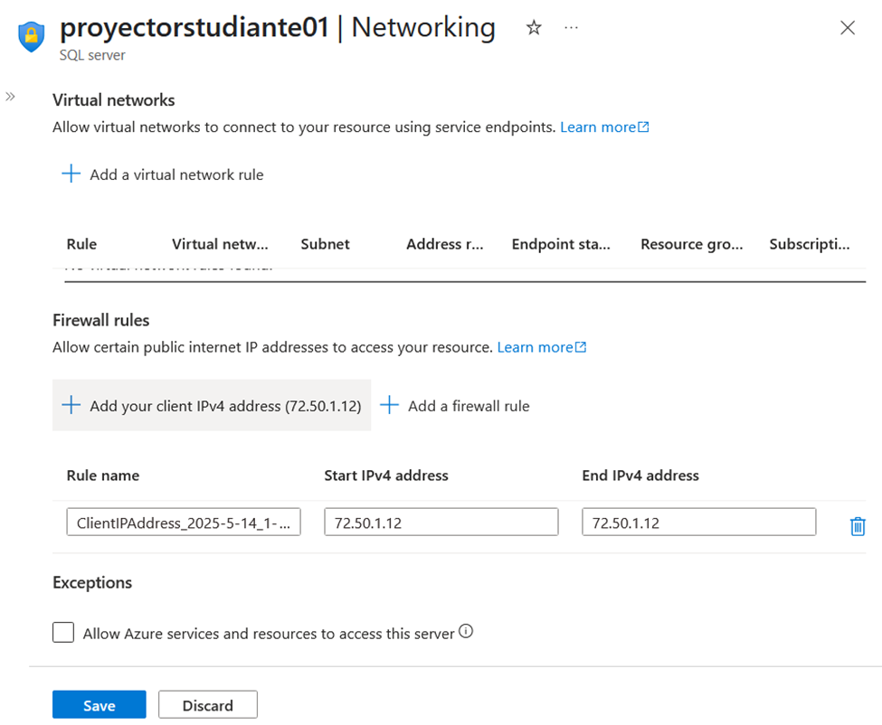
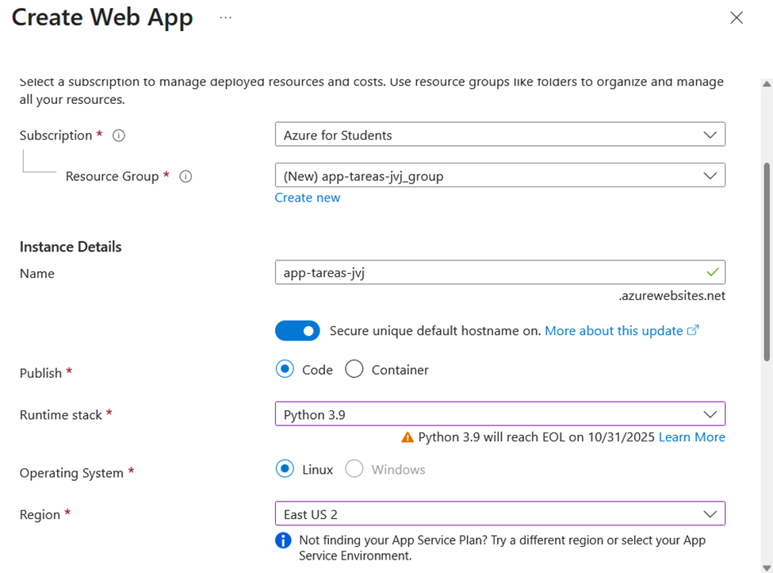

# Cloud-Computing
# Proyecto de Aplicación Web en Azure for Students

## Gestor de Tareas
---

## Integrantes del Equipo
- John Valentín Jiménez - R00628924  - jvalentin8924@arecibointer.edu
---

## 🎯 Descripción General
La aplicación es un gestor de tareas desarrollado con Flask que permite a los usuarios crear, marcar como completadas y eliminar tareas, desplegado en Azure App Service con integración a GitHub y utilizando Azure SQL Database como base de datos en la nube. Está dirigida principalmente a estudiantes que necesitan organizar sus actividades académicas, pero también puede servir como Sprint Backlog para equipos ágiles, ofreciendo una solución práctica para gestionar pendientes mientras demuestra el funcionamiento integrado de servicios cloud.
---

## ☁️ Servicios de Azure Utilizados
| **Servicio**            | **Propósito dentro del proyecto**                                         | **Gratuito en Azure for Students** |
| ----------------------- | ------------------------------------------------------------------------- | ---------------------------------- |
| Azure App Service (F1)  | Hosting de la aplicación web Flask y conexión con GitHub para deployment. | Sí                                 |
| Azure SQL Database (S0) | Base de datos en la nube.                                                 | Sí                                 |
| Azure SQL Server        | Permitir realizar gestiones con la base de datos SQL.                     | Sí                                 |
| GitHub                  | Conexión con branch main y App Service para hacer el deployment.          | Sí                                 |

## 🧱 Diagrama de Arquitectura

---

## ⚙️ Despliegue y Configuración

### 1. Preparación Local
1. El primer paso para ejecutar la aplicación localmente es cloner el repositorio.
git clone https://github.com/Drewster64/Cloud-Computing.git
cd Cloud-Computing
2. Se debe crear un ambiente virtual
python -m venv venv
source venv/bin/activate  para Linux/macOS
venv\Scripts\activate     para 
3. Configurar el entorno
SQL_SERVER=su_servidor.database.windows.net
SQL_DATABASE=proyecto_tareas
SQL_USERNAME=su_usuario
SQL_PASSWORD=su_contraseña
4. Luego de estos pasos se debe ejecutar el archivo python
python app.
5. Como resultado debe obtener un path como http://localhost:5000 con el que podrá acceder al proyecto de manera local.

### 2. Configuración en Azure
1. Iniciar sesión en Microsoft Azure.
2. Crear un SQL Database com nombre proyecto_tareas y debe crear un nuevo server con usuario y contraseña SQL.
3. Seleccionar plan S0 como alternativa económica y haga clic en revisar y crear. 
4. En SQL Servers, seleccione el server creado y en firewalls agregue su IP actual, si su red cambia constantemente de IP agregue un rango dentro del que se encuentren los IP que podría obtener su máquina.
5. Obtenga la cadena de conexión ODBC dentro de SQL Databases. Copie el código y reemplace el password por el creado en el paso 2.
6. Seleccione App Services en Azure, utilice app-tareas-(sus iniciales o nombre).
7. Seleccione F1 como alternativa económica.
8. Para configurar variables de entorno, en App Service seleccione Configuración de la aplicación y agregue las siguientes claves:

| Nombre       | Valor                                       |
| ------------ | ------------------------------------------- |
| SQL_SERVER   | servidor.database.windows.net (Su servidor) |
| SQL_DATABASE | proyecto_tareas                             |
| SQL_USERNAME | adminuser@servidor                          |
| SQL_PASSWORD | TuContraseñaSegura123 (Su contraseña)       |

9. Luego de esto, siga los pasos requeridos anteriormente en la sección Preparación Local para poder probar el proyecto localmente en su máquina.
---

### 3. Automatización 
1. Para el despliegue con GitHub actions y Azure, primero debe crear el repositorio en GitHub que va a utilizar.
2. Luego haga un push de los archivos creados anteriormente.
3. En Microsoft Azure, seleccione su aplicación en App Services y vaya de Centro de Implementación.
4. Conecte al repositorio mencionado anteriormente y seleccione la rama en la que se encuentra el proyecto.
5. Si los requisitos están cumplidos, Azure desplegará su proyecto.
6. Utilice el link de su app service para verificar el funcionamiento del proyecto. Por ejemplo: "https://app-tareas-jd.azurewebsites.net".
---

## 💻 Enlace a la Aplicación Desplegada
> https://app-tareas-jvj-ddgfa3bsevhrh8ce.eastus2-01.azurewebsites.net/
---

## 💸 Estimación del Costo (Azure Pricing Calculator)
1. A continuación comparación de nuestros principales servicios sin los descuentos para estudiantes:

El servicio de App Services para el web app tiene un costo de $372.97

---

El servicio de App Services para el web app tiene un costo de $54.75

---

## 📁 Capturas del Portal de Azure
Creación del server de la base de datos:

---

Creación de user con password:

---

Creación de la base de datos:

---

Desplegar server: 

---

Modificar firewall para acceder solo de ciertas IP:

---

Agregar Ip del user:

---

Crear Web App en App Services:

---

## 📘 Lecciones Aprendidas
- ¿Qué retos enfrentaron y cómo los resolvieron?
- ¿Qué aprendieron sobre trabajar con servicios cloud?
- ¿Qué mejorarían en una próxima versión del proyecto?

---

## 📚 Repositorio del Código
> https://github.com/Drewster64/Cloud-Computing.git
---

## 📄 Instrucciones para Reproducir el Proyecto
1. Clonar el repositorio.
2. Instalar dependencias: `pip install -r requirements.txt` (si aplica).
3. Crear base de datos (opcional: script SQL incluido).
4. Crear variables de entorno necesarias.
5. Ejecutar la aplicación: `python app.py` o comando correspondiente.
6. Acceder desde `localhost` o mediante el App Service.

---

## ✅ Checklist Final
- [ ] App funcional y desplegada
- [ ] Servicios gratuitos utilizados correctamente
- [ ] Diagrama de arquitectura incluido
- [ ] Documentación clara y completa
- [ ] Costos estimados incluidos
- [ ] Repositorio disponible en GitHub
- [ ] Lecciones aprendidas y reflexión final escritas

---

## 🎓 Créditos
Curso: Cloud Computing  
Profesor: Javier A. Dastas  
Universidad Interamericana de Puerto Rico – Recinto de Arecibo